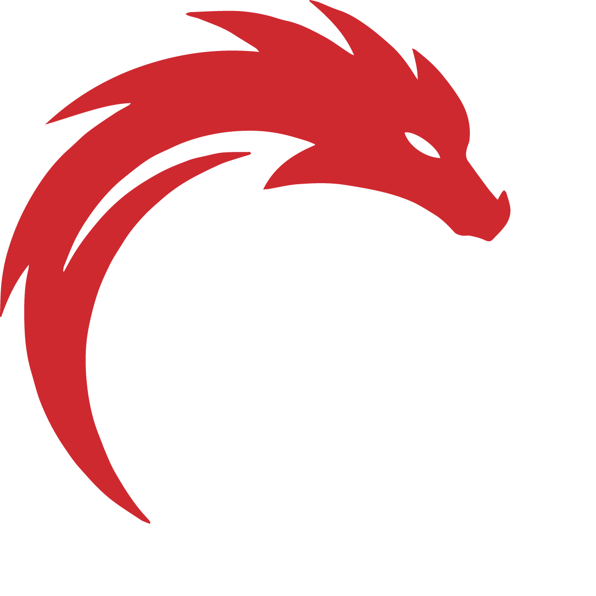

**Официальные правила (укороченная версия): 07.10.2025**  
**FCFS - Gi  / FCFS - No Gi**

---

## Содержание
- [1. Разрешённые действия в FCFS](#short-1)
- [2. Форма спортсменов](#short-2)
- [3. Судейская коллегия](#short-3)
- [4. Порядок и проведение основного времени поединка](#short-4)
- [5. Броски](#short-5)
- [6. Борьба в партере](#short-6)
- [7. Удушающие и болевые приёмы](#short-7)
- [8. Удержания](#short-8)
- [9. Действия вблизи границы ковра](#short-9)
- [10. Оценка приёмов и бросков](#short-10)
- [11. Golden Score](#short-11)
- [12. Досрочная победа](#short-12)
- [13. Предупреждения и замечания](#short-13)
- [14. Снятие спортсмена с поединка](#short-14)
- [15. Дисквалификация](#short-15)
- [16. Фиксация сдачи и остановка поединка (дети, белые и жёлтые пояса)](#short-16)
- [17. Особенности ударов в поединках (детеи до 14 лет, белые и жёлтые пояса)](#short-17)
- [18. Жесты судей](#short-17)

---

# 1. Разрешённые действия в FCFS-PRO Division.
В поединках FCFS-PRO Division разрешены следующие технические действия: Броски, удержания, удушающие и болевые приемы, защита и контратака, удары ногами, руками и коленями.
- Раздел No Gi: допускаются удушающие приёмы руками непосредственно за шею соперника.
- Раздел Gi: удушения руками только за шею запрещены; разрешены удушающие приёмы через шею и руку соперника, а также удушения с использованием куртки (включая варианты с прямым воздействием на шею).

Во всех остальных аспектах правила в разделах Gi и No Gi идентичны; различия касаются лишь формы одежды и указанных ограничений по удушающим приёмам.

# 2. Форма спортсменов

## 2.1 Куртка (раздел Gi)
- Стандартная куртка самбо с поясом.
- Спортсмен, которого вызывают первым, обязан надеть красную или черную куртку. Спортсмен, которого вызывают вторым, обязан надеть синюю или белую куртку.

## 2.2 Пояс (раздел Gi)
- Спортсмен может носить пояс цвета куртки или пояс, обозначающий его уровень подготовки в FCFS либо в другом виде единоборств.

## 2.3 Обувь
- Спортсмены выступают босиком. В разделе Gi допускается использование мягкой обуви из кожи или аналогичного материала, закрывающей стопу и щиколотку, без жёсткой подошвы и металлических элементов.

## 2.4 Шорты 
- Просторные бойцовские или борцовские шорты, не сковывающие движения. Без карманов, без металлических элементов, без жестких застежек и липучек.
- Длина – не выше середины бедра и не ниже колена. Цвет шорт в соответствии с регламентом турнира.

## 2.5 Рашгард 
- Обтягивающая эластичная футболка с длинными или короткими рукавами. Без карманов, молний и выступающих элементов. В разделе Gi разрешено выступление без рашгарда под курткой.

## 2.6 Лосины
- Облегающие компрессионные штаны.
- Должны быть без карманов, молний и дополнительных элементов, которые могут привести к захвату.
- разрешено выступление без лосин.

## 2.7 Перчатки
- В боевом разделе используются перчатки типа MMA (Mixed Martial Arts).  
- Вес перчаток: 4–6 унций для взрослых категорий; 6–8 унций — для юниоров и начинающих спортсменов.
- Перчатки должны обеспечивать защиту кистей и суставов при сохранении возможности выполнять захваты и удержания.
- Обязательна мягкая ударная поверхность и надёжная фиксация запястья (липучка или ремень). 
- Запрещены любые металлические, пластиковые или иные твёрдые вставки, а также повреждённые или чрезмерно изношенные перчатки.
- Перчатки должны быть чистыми, сухими и допущенными судьёй или официальным представителем до начала поединка.

## 2.8 Накладки на ноги
- В боевом разделе используются защитные накладки на голени и подъём стопы (shin guards), аналогичные применяемым в любительском ММА.  
- Накладки должны быть выполнены из мягких синтетических или кожаных материалов с плотной амортизацией, обеспечивающей защиту голени и стопы.
- Конструкция должна надёжно фиксироваться липучками или эластичными ремнями и не смещаться во время поединка.
- Запрещены накладки с твёрдыми вставками, металлическими элементами или жёсткими каркасами. 
- Накладки должны быть чистыми, сухими и не иметь повреждений, которые могут причинить травму сопернику.
- Проверку и допуск накладок осуществляет судья или официальный представитель перед началом поединка.

## 2.9 Шлем
- В боевом разделе спортсмены обязаны использовать защитный шлем (head guard), предназначенный для поединков по типу MMA или боевого самбо.  
- Шлем должен обеспечивать защиту лба, щёк, подбородка и затылка, при этом не ограничивать обзор и дыхание спортсмена.
- Допускаются модели с открытым лицом или с мягкой защитой щёк. В любительских боях предпочтительно использование шлемов с защитой подбородка.
- Материал шлема — синтетическая или натуральная кожа с внутренним мягким амортизирующим слоем. 
- Запрещены шлемы с твёрдыми элементами, металлическими застёжками или повреждёнными участками.
- Шлем должен быть чистым, сухим и соответствовать размеру головы спортсмена.
- Проверку и допуск шлема проводит судья или официальный представитель перед началом поединка.

## 3.0 Дополнительные требования
- Запрещены любые элементы, которые могут травмировать соперника (молнии, твердые накладки и т. д.)

# 3. Судейская коллегия
В поединках FCFS ковер обслуживают три арбитра, а за проведение всего соревнования отвечает главный судья.

4. Порядок и проведение основного времени поединка
1. Спортсменов вызывают на ковер: красный/черный — в красный угол, синий/белый — в синий.
2. Перед началом — выход в центр, рукопожатие, шаг назад. По команде арбитра «Fight» начинается поединок.
3. Команда «Stop» останавливает бой. После неё возобновление всегда из стойки по команде «Fight».
4. Команда «Time» - конец основного времени поединка.
5. Засчитываются действия и нарушения, выполненные до окончания времени на табло (или ручного секундомера). После «Stop» или «Time» действия не оцениваются.
6. Результат: арбитр в центре поднимает руку победителя, спортсмены жмут руки и покидают ковер.
7. Поединок ведётся в чистом времени: отсчёт начинается по команде “Fight”, паузы не учитываются.

5. Действия в стойке (броски и удары)
1. За неудачный бросок с падением атакующего баллы не даются, если не было контратаки.
2. Контрбросок — активный перехват атаки с изменением её направления или остановкой.
3. Если защищающийся не изменил падение и упал вместе с атакующим, бросок засчитывается атакующему.
4. Засчитываются только броски, начатые атакующим из стойки. Если он сам в партере — бросок не засчитывается.
5. Бросок без падения — атакующий всё время остаётся в стойке. Такие броски оцениваются выше.
6. Бросок с падением — атакующий сам уходит в партер или опирается на соперника.
7. Поднятие соперника из партера с полным отрывом и вращением считается броском из стойки.
8. Если атакующий в стойке бросает соперника из положения партера, бросок оценивается в половину.
9. Переход на болевой с падением соперника засчитывается как бросок при акцентированном падении.
10. Разрешённые удары в стойке: удары руками (кулаком или ладонью), ногами (стопой или голенью).Удары коленями разрешены только по корпусу.
11. Запрещённые удары в стойке: удары головой, локтями, коленями в голову, а также удары по затылку, позвоночнику, шее, горлу, трахее, паху и суставам. Наносить удары по сопернику, находящемуся в положении партера (три и более точки опоры), запрещено.Не допускаются умышленные удары по сопернику, который перестал активно защищаться или находится под контролем судьи. За нарушение данных правил судья немедленно останавливает поединок и применяет предупреждение, снятие баллов или дисквалификацию — в зависимости от тяжести нарушения.
12.Падение соперника, вызванное разрешённым ударом рукой, ногой или коленом, при котором соперник теряет равновесие и касается ковра любой частью тела, приравнивается к броску.
13.Падение, не вызванное действием соперника (например, потеря равновесия без контакта), не засчитывается как бросок.

# 6. Действия в партере (Борьба и удары)

1. Борьба в партере начинается, когда оба соперника оказываются в положении «лёжа». После каждого перехода в партер на борьбу отводится 1 минута (30 секунд для любителей и детей до 12 лет).
2. Если в момент окончания отведенного времени на борьбу в партере идёт отсчёт на выполнение удержания, болевого или удушающего приёма, он продолжается до завершения 10-секундного отсчёта. Если в этот период происходит сдача, она фиксируется в соответствии с правилами. После завершения отсчёта поединок останавливается, и соперников поднимают в стойку.
3. Если болевой или удушающий приём был зафиксирован до сигнала об окончании поединка (гонг или команда “Time”), отсчёт на его проведение продолжается в соответствии с установленными правилами – 10 секунд, несмотря на окончание основного времени встречи. Если в течение этих 10 секунд соперник сдался, сдача фиксируется по правилам.
4. Борьба в партере продолжается до тех пор, пока один или оба спортсмена ведут активные действия: атакуют, защищаются, переходят с приёма на приём или динамично пытаются изменить положение. 
5. Борьба в партере прекращается, если:
    - Фиксируется сдача одного из спортсменов.
    - Один из спортсменов встаёт в стойку.
    - Оба спортсмена выходят за рабочую зону ковра.
    - Оба спортсмена фиксируются в статичном положении без попыток атаковать или защищаться. В этом случае судья поднимает их в стойку.
    - Если соперник перестаёт активно защищаться, а противник продолжает наносить разрешённые удары руками, судья немедленно останавливает бой и фиксирует досрочную победу (технический нокаут).
    - Если удары становятся чрезмерно жёсткими и создают реальную угрозу травмы, судья останавливает бой, делает предупреждение атакующему или объявляет технический нокаут — в зависимости от ситуации.
6. Болевые и удушающие приёмы разрешается начинать проводить только тогда, когда атакуемый находится в положении «лёжа», при этом атакующий может находиться в положении «стоя».
7. Началом болевого приёма считается момент в поединке, когда атакующий фиксирует конечность противника с целью вызвать болевое ощущение и создает угрозу завершения приёма. Начало болевого приёма фиксирует главный судья на ковре командой «Submission» и начинает отсчет.
8. Началом удушающего приёма считается момент в поединке, когда атакующий фиксирует шею противника и создает видимую для судьи угрозу ограничения или полного прекращения подачи крови к мозгу либо воздуха в лёгкие с целью добиться сдачи или потери сознания. Имитация удушающего приёма не является основанием для его фиксации.
9. Выполнение такой фиксации болевого или удушающего приёма оценивается в 1 балл, если он проводился непрерывно и создавал угрозу завершения в течение 10 секунд. Независимо от того, удерживается ли приём дольше этого времени.
10. Если болевой или удушающий приём не представляет угрозы завершения, судья не начинает отсчёт времени на его выполнение.   
11. После завершения 10-секундного отсчёта на один такой приём судья даёт команду “One Point”, фиксирует начисление 1 балла и прекращает отсчёт, но продолжает держать кулак сжатым, если сохраняется опасное положение и угроза его завершения.
12. За удержание этого же приёма дополнительные баллы не начисляются, независимо от продолжительности его удержания. Чтобы получить очередные баллы, спортсмен должен перейти на другой болевой или удушающий прием и зафиксировать его, после чего судья начинает новый отсчёт времени. Или завершить данный болевой прием сдачей противника.
13. Если угроза завершения приёма исчезает, судья разжимает кулак и останавливает отсчет. Если угроза возобновляется, судья снова сжимает кулак и продолжает отсчет с начала: “One, Two, Three”.  
14. Количество болевых и удушающих приёмов, за которые можно получить баллы в течение 1 минуты борьбы в партере, не ограничено.
15. Если после начала фиксации , но не менее чем через 3 секунды отсчета, соперник, уходя от болевого или удушающего, поднялся в стойку. При этом судья продолжал отсчёт и держал руку в кулаке, показывая опасное положение и угрозу завершения приёма, выполнявшему приём присуждается 1 балл.
16. Если это произошло после 10 секунд отсчёта, и при этом судья продолжал фиксировать опасное положение сжатым кулаком, спортсмен, выполнявший приём, получает 1 балл за 10 секунд выполнения  приема и дополнительно 1 балл за уход соперника в стойку из опасного положения.
17. Если соперник успел подняться в стойку до истечения 3 секунд отсчёта после фиксации , баллы никому не присуждаются.
18. Проведение болевого приёма на ногу должно быть прекращено, как только атакуемый переходит в положение «стоя» и фиксирует свою устойчивую позицию.
19. Проведение болевого приёма на руку должно быть прекращено, как только оба спортсмена оказываются в положении стоя (полный отрыв соперника от ковра).
20. Проведение удушающегого приёма  должно быть прекращено, как только атакуемый переходит в положение «стоя» .
21. Болевой приём засчитывается выполненным, если в ходе его выполнения атакуемый подал сигнал о сдаче. Сигнал о сдаче подаётся громким возгласом и(или) многократным хлопком рукой или ногой по ковру, по своему телу или телу соперника. Любой возглас участника, взятого на болевой приём, cчитается сигналом о сдаче.
22. Сигнал о сдаче от удушающего приема подаётся любым отчетливым возгласом, хрипом и(или) многократным хлопком рукой или ногой по ковру, своему телу или телу соперника. 
23. Прерывание поединка по просьбе атакуемого, находящегося на болевом или удушающем, если это не вызвано нарушением правил со стороны атакующего, расценивается как сигнал о сдаче.
24. Сдача от болевого и удушающего приёма фиксируется арбитром командой «Stop, Submission Done» и оценивается в 6 баллов. После подтвержденной сдачи судья присуждает баллы и поднимает спортсменов в стойку.
25. В случае сдачи от  приёма  после полной 10-секундной фиксации (то есть по завершении отсчёта времени),  за этот болевой или удушающий приём присуждается максимальная оценка – 6 баллов, аналогично сдаче, произошедшей в течение первых 10 секунд.
26. Если один из спортсменов, спасаясь от болевого или удушающего приёма, явно выполз вместе с противником  за границы рабочей зоны ковра, при этом судья продолжал отсчет или фиксировал опасное положение сжатым кулаком, его противник получает 1 балл.
27. Если оба спортсмена вышли за границы рабочей зоны в процессе активной обоюдной борьбы в партере, баллы никому не присуждаются. В обоих случаях (6.25/6.26)  поединок останавливается, и соперники поднимаются в стойку.
28. В партере разрешены только удары руками (кулаком или ладонью).Положением партера считается момент, когда спортсмен имеет три и более точки опоры на ковре. Наносить удары из стойки по сопернику, находящемуся в положении партера, запрещено.
29. Запрещены удары по затылку, позвоночнику, шее, суставам и паху, а также удары локтями, ногами и коленями в любом положении. Судья немедленно останавливает поединок при нарушении этих правил и выносит предупреждение, замечание или дисквалификацию в зависимости от степени нарушения.

# 7. Удушающие и болевые приемы

## 7.1 Разрешенные категории удушающих приёмов
Разрешены все виды удушающих приёмов (с использованием одежды и без неё, руками и ногами); полный перечень допустимых действий приведён в официальных правилах FCFS.

## 7.2 Запрещённые удушающие приёмы
- Только для раздела Gi: Удушающие руками только за шею без использования куртки или руки соперника.
- Удушающие с давлением на подбородок. Приёмы, где основное воздействие идёт на нижнюю челюсть и кадык , а не на шею.
- Удушающие с воздействием на позвоночник или скручиванием шеи. Любые приёмы, создающие чрезмерную нагрузку на шейный отдел позвоночника.
- Удушающие поясом.
- Удушающие приёмы ногами, выполняемые только на шее без фиксации руки соперника.
- Выпрямление скрещённых ног, создающее давление на шею 
- Рывковые и чрезмерно агрессивные удушения, выполняемые с резкими движениями, создающими риск серьёзной травмы  шеи или позвоночника.

## 7.3 Запрещённые болевые приёмы
- Болевые на пальцы рук и ног, а также на кисти.
- Узлы и замки стопы (Knot Foot Lock, Foot Lock, Toe Hold, Straight Ankle Lock, Heel Hook, Twisting Foot Lock).
- Рычаг колена с перегибанием вне естественной плоскости сгиба.
- Жёсткий и резкий загиб руки за спину («полицейский захват» / Police Lock).
- Болевые воздействия на позвоночник, включая специальные приёмы (neck crank, twister и аналогичные), выпрямление скрещённых ног, создающее давление на позвоночник.

# 8. Удержания

1. Отсчёт времени удержания начинается по команде арбитра «Hold» с того момента, когда атакующий прижался своим туловищем к туловищу противника (или к рукам противника, прижатым к туловищу) и фиксирует его в положении «на лопатках». Вытягивает руку ладонью вниз и отсчитывает секунды движением руки: «One… Nine». На «Ten – One point» удерживающему присуждается 1 балл. Если удержание сорвано раньше — счёт прекращается и удержание не засчитывается.
2. Удержание оцениваются в 1 балл за 10 секунд его выполнения. Количество удержаний во время поединка не ограничено. Но одно удержание оценивается всего один раз за каждый переход в партер.
3. Удержание прекращается в случае:  
    - eсли спортсмен, которого удерживают, переходит в положение «на груди», «на животе» или «на ягодицах» (но не «на пояснице»), при котором угол между его спиной на уровне лопаток и плоскостью ковра станет больше 90 градусов;
    - если плотность удержания теряется и становится недостаточной для эффективного контроля туловища удерживаемого и ограничения его движений;
    - если атакующий или атакуемый переходит к проведению болевого приёма;
    - если во время проведения удержания оба спортсмена оказались в положении «вне ковра»; 
    - если удерживаемый спортсмен обвивает ногой ногу или туловище удерживающего двумя ногами одновременно (hooking / leg entanglement with both legs), либо скрещивает ноги вокруг ноги или туловища удерживающего;
    - если удерживаемый спортсмен находится в положении гарда или полугарда, т.е. имеет ногу удерживающего в контроле, независимо от глубины или силы захвата.
4. Удержание засчитывается как сдача, если в ходе его выполнения удерживаемый подал сигнал о сдаче.
5. Прерывание схватки по просьбе атакуемого, находящегося на удержании, если это не вызвано нарушением правил со стороны атакующего, расценивается как сигнал о сдаче.
6. Если удержание было зафиксировано до сигнала об окончании поединка (гонг или команда “Time”), или до окончания положенного времени на борьбу в партере, отсчёт на его проведение продолжается в соответствии с установленными правилами – 10 секунд, несмотря на окончание основного или положенного времени встречи. Если в течение этих 10 секунд соперник сдался, сдача фиксируется по правилам.

# 9. Действия вблизи границы ковра

1. В течение поединка спортсмены не имеют права выходить за пределы ковра без разрешения арбитра.
2. По решению арбитра спортсмен может покинуть ковёр для замены спортивной формы (боковой судья должен сопровождать спортсмена).
3. Положение «вне ковра»  считается, если:
    - в положении стоя оба спортсмена заступил двумя ногами за границу рабочей зоны ковра;
    - в положении «лёжа» оба спортсмена оказались за границей рабочей зоны ковра;
    - в положении «лёжа» один из спортсменов имеет контакт с площадью за пределами зоны безопасности ковра.
4. В ходе поединка положение «вне ковра» определяется одним из судей, а при обсуждении спорных моментов, большинством судейской тройки.
5. Оказавшись в положении «вне ковра», спортсмены по команде «Stop» арбитра возвращаются на середину ковра и возобновляют поединок в положении «стоя».
6. Бросок (контрбросок), начатый в пределах рабочей зоны ковра и закончившийся за её пределами, но в пределах зоны безопасности ковра, оценивается, при условии, что после падения, туловище атакуемого, полностью остается в пределах зоны безопасности ковра.
7. Бросок (контрбросок), начатый в пределах рабочей зоны ковра и закончившийся за пределами зоны безопасности ковра, не оценивается (если какая-либо часть туловища атакуемого находится за пределами зоны безопасности ковра).
8. Бросок, начатый в положении «вне ковра», не оценивается.
9. Удержание и болевой приём разрешается открывать, проводить и засчитывать пока один из спортсменов имеет контакт с рабочей площадью ковра, а второй спортсмен, должен находиться в пределах зоны безопасности ковра.

# 10. Оценка приёмов и бросков

Оценка броска зависит от:
  - без падения или с падением проводил бросок атакующий;
  - в каком положении находился атакуемый;
  - на какую часть тела упал в результате броска атакуемый.

В ходе поединка оценка технических действий спортсменов определяется большинством голосов судейской тройки.

**Шесть баллов (6 Points)** - судья показывает прямую руку вверх, ладонь открыта:
  - За бросок без падения атакующего, при котором противник упал на спину или в положение «мост»
  - За сдачу соперника под воздействием болевого или удушающего приёма, а также во время удержания
  - При нокдауне, когда судья начинает отсчёт.

**Четыре балла (4 Points)** - согнутая рука вверх, показаны 4 пальца:
  - За бросок без падения атакующего, при котором противник упал на бок или в положение «полумост»;
  - За бросок с падением атакующего, при котором противник упал на спину или в положение «мост»;
  - За бросок без падения атакующего, при котором противник, находящийся в положении лёжа, упал на спину или в положение «мост»;

**Два балла (2 Points)** - согнутая рука вверх, показаны 2 пальца:
  - За бросок без падения атакующего, при котором противник упал на грудь, живот, ягодицы, поясницу или плечо.
  - За бросок с падением атакующего, при котором противник упал на бок или в положение «полумост».
  - За бросок , при котором противник, находящийся в положении лёжа, упал на спину или в положение «мост».

**Один балл (1 Point)** - согнутая рука вверх, показан большой палец:
  - За бросок с падением атакующего, при котором противник упал на грудь, живот, ягодицу(ы), поясницу или плечо.
  - За бросок , при котором противник,находящийся в положении лёжа, упал на бок или в положение «полумост».
  - За первое замечание, объявленное противнику.
  - За фиксацию удержания 10 секунд
  - За удержание и проведение болевого или удушающего приема 10 сек.
  - За убегание в стойку от болевого или удушающего приема во время его фиксации арбитром, если фиксация длилась 3 секунды и более.
  - За выползание за пределы рабочей зоны ковра вместе с противником в попытке избежать болевого или удушающего приема.

# 11. Поединок до Golden Score

Если основное время поединка заканчивается без победителя с ничейным результатом, даётся дополнительная минута борьбы до «Golden Score» . В этот период борьба продолжается до первого результативного действия  (1 балл или более) или замечания. По истечению дополнительной минуты, победитель оценивается решением судейской тройки.

# 12. Досрочная победа присуждается

1. Когда один из спортсменов первым набирает 12 баллов, независимо от разницы в счёте. 
2. Нокаут — если соперник не готов продолжить бой до окончания 10-секундного отсчёта или не подаёт признаков движения после удара, судья немедленно останавливает поединок и фиксирует нокаут.
3. При снятии соперника с поединка или его дисквалификации.

# 13. Предупреждения и замечания

## 13.1 Предупреждение
1. Арбитр на ковре сначала выносит предупреждение, если спортсмен допускает незначительное нарушение, выходит за ковер, уклоняется от борьбы или затягивает время и т.д.
2. Предупреждение не влияет на результат поединка и не фиксируется в судейском протоколе.
3. Если спортсмен после предупреждения продолжает нарушать правила или избегает борьбы, ему выносится замечание.

## 13.2 Замечания и их последствия
1. Первое замечание — 1 балл сопернику
2. Второе замечание — 2 балла сопернику
3. Третье замечание — чистое поражение (дисквалификация за замечания)

## 13.3 Дополнительные положения
1. За грубые нарушения или неспортивное поведение арбитр может сразу назначить чистое поражение без предварительных замечаний.
2. Все замечания фиксируются в судейском протоколе.
3. В течение поединка предупреждения и замечания объявляются по решению большинства голосов судейской тройки.

## 13.4 Действия влекущие предупреждение и замечания
1. Намеренное затягивание времени.
2. Опасные или запрещенные действия (запрещенные удары, грубая борьба, нарушения экипировки).
3. Споры с судьями, неспортивное поведение.
4. Частый и явный свободный или умышленный выход за границу рабочей зоны в положении стоя или лежа.
5. Пассивность (уклонение от захвата в положении стоя, отказ от атакующих действий, затягивание времени схватки).
6. Ложная атака (переход в положение лежа без реальной атаки, атакуемый не теряет равновесие).
7. Частое выталкивание (выведение соперника за границу рабочей зоны ковра, используя блокирующий захват, без намерения выполнить бросок).
8. Умышленное нарушение формы одежды (закатывание рукавов куртки, развязывание пояса и шнурков , снятие борцовок и т. п.).
9. Имитация борьбы.
10. Запрещенные захваты:
    - Умышленный захват за шорты, за шнуровку и борцовки изнутри
    - Умышленный захват за пальцы на руках и ногах соперника
11. За опоздание на ковер:
    - 30 сек – 1 замечание.
    - 90 сек – 2 замечание.
    - 120 сек – 3 замечание и снятие с поединка.

## 13.5 Запрещенные приемы за которые сразу дается замечание
За проведение запрещённого приёма спортсмену сразу объявляется замечание с оценкой, а при повторной попытке проведения запрещённого приёма, спортсмен снимается с поединка. 
1. Грубое Проведение запрещенного приема.
2. Умышленный бросок соперника на голову.
3. Умышленное проведение болевого приема после команды «Stop».
4. Проведение болевого приема в положении противника стоя.
5. Проведение технического действия “Ножницы”. 
6. Прямое болевое воздействие на позвоночник и шею.
7. Болевые приемы на пальцы рук, ног и кисти.
8. Узлы и замки стопы. (Knot Foot Lock, Foot Lock,Toe Hold, Straight Ankle Lock, Heel Hook, Twisting Foot Lock) 
9. Рычаг колена, перегибая его не в плоскости естественного сгиба.
10. Жесткий и резкий загиб руки за спину. “полицейский захват” (“Police Lock”)
11. Прямое воздействие локтем или коленом на любую часть тела соперника.
12. Запрещенные удары.
13. Запрещается поднимать соперника с последующим сбросом на ковёр (slamming) для выхода из гарда, а также для освобождения от болевого или удушающего приёма (например, рычаг локтя, triangle choke).
14. Давление на глаза, затыкание ушей, открытые захваты лица.
15. Захваты за горло с прямым сдавливанием трахеи или гортани.
16. Специальные воздействия на позвоночник, включая выпрямление скрещённых ног, создающее давление на шею или позвоночник соперника, а также приёмы типа (neck crank / twister);
17. Залезание пальцами в рот или ноздри (fish hooking).
18. Давление или удары в пах.
19. Нецензурные, оскорбительные или провокационные действия по отношению к сопернику, судьям и зрителям.

# 14. Снятие спортсмена с поединка

Снятие спортсмена с поединка осуществляется решением главного судьи, если судейская тройка приняла единогласное решение или если большинство судей поддерживает это решение. В этом случае поединок немедленно останавливается, а его сопернику присуждается досрочная победа.
Снятие спортсмена с поединка происходит в случае 
1. Повторного проведения запрещённого приёма.
2. По решению врача (если спортсмен не может продолжать участие в соревнованиях (заболевание, травма, рвота).
3. В результате превышения лимитов времени и наказаний.
    - если спортсмен не смог уложиться в отведённые 2 минуты на оказание медицинской помощи
    - опоздание на ковёр по истечению 2 минут после первого вызова
    - после трёх предупреждений при необходимости объявить спортсмену четвёртое предупреждение

# 15. Дисквалификация

Дисквалификация происходит в случае:
1. Неэтичное поведение.
2. Умышленный грубый удар, царапины, укусы.
3. Нанесение травмы сопернику в результате выполнения запрещенного приема, при невозможности последнего продолжать соревнования.
4. Оскорбительные ругательства и жесты в адрес соперника, судей, участников, зрителей. 

# 16. Фиксация сдачи и остановка поединка (дети до 12 лет, белые и жёлтые пояса)

1. Сдача фиксируется при явном сигнале (хлопки, голос, другие признаки).
2. Судья немедленно останавливает бой и засчитывает сдачу:
    - при полном выпрямлении руки в болевом;
    - при полном выпрямлении колена в «рычаге колена» с фиксацией ног;
    - при удушении — при потере активной защиты или признаках потери сознания.
3. Если приём проводится опасно (против естественного сгибания сустава и т.п.), судья даёт «Stop» и переводит бой в стойку без наказания.
4. При грубом или намеренно травмоопасном действии (избыточная сила, запрещённый приём) — судья даёт «Stop» и выносит замечание атакующему.

# 17. Особенности ударов в поединках (дети до 14 лет, белые и жёлтые пояса)
  - Разрешаются только удары по корпусу — руками (кулаком или ладонью) и ногами (стопой или голенью).
  - Запрещены любые удары в голову и любые удары коленями, локтями и головой.
  - В положении партера нанесение любых ударов запрещено.
  - Поединки проводятся с акцентом на технику, контроль и безопасность, а не на силу ударов.
  - Судья обязан немедленно останавливать бой при излишней жёсткости или потере самообладания одним из участников.

# 18. Жесты судей
Все жесты судей подробно описаны в полной версии официальных правил FCFS.
